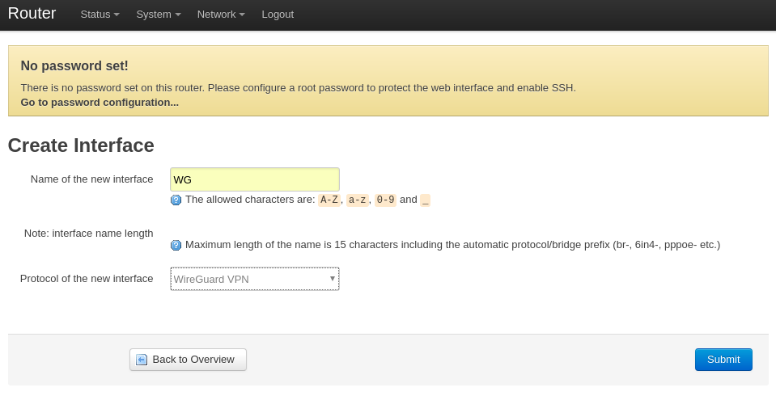
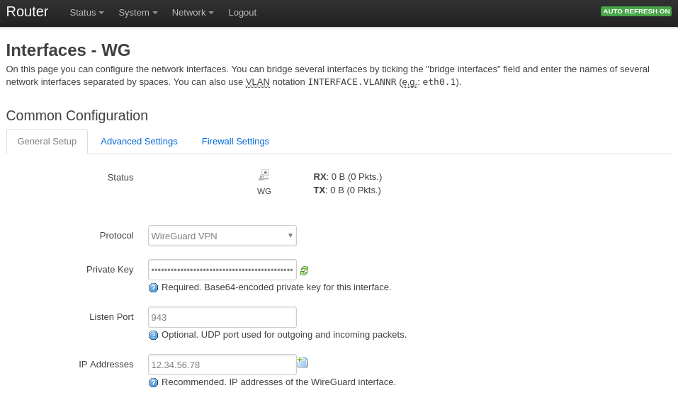
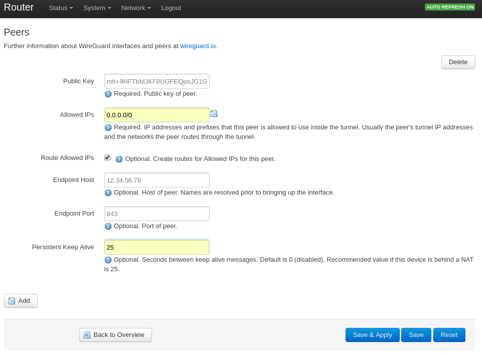
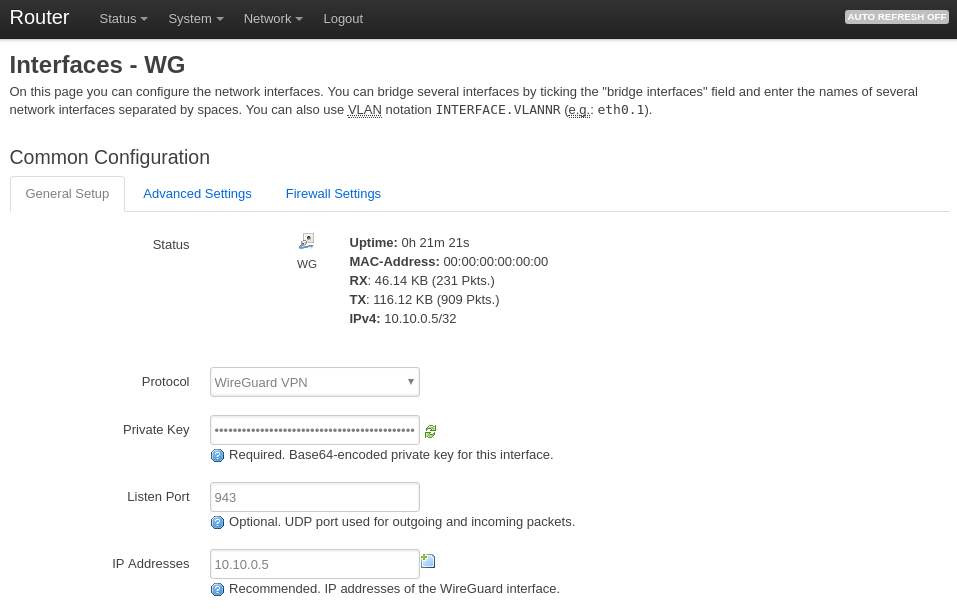
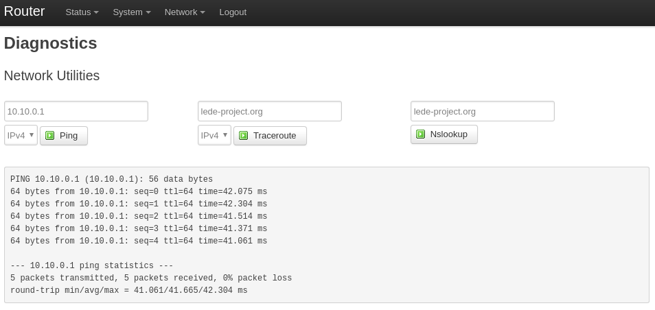

# OpenWrt / LEDE 安装 WireGuard，建立 VPN 隧道

### 安装 WireGuard

SSH 登录刷入 LEDE 系统的路由器

```
ssh root@192.168.1.1
```
默认用户名 ```root```，有密码就用密码登录，没密码直接登录

```BusyBox v1.25.1 () built-in shell (ash)

     _________
    /        /\      _    ___ ___  ___
   /  LE    /  \    | |  | __|   \| __|
  /    DE  /    \   | |__| _|| |) | _|
 /________/  LE  \  |____|___|___/|___|                      lede-project.org
 \        \   DE /
  \    LE  \    /  -----------------------------------------------------------
   \  DE    \  /    Reboot (17.01.4, r3560-79f57e422d)
    \________\/    -----------------------------------------------------------

=== WARNING! =====================================
There is no root password defined on this device!
Use the "passwd" command to set up a new password
in order to prevent unauthorized SSH logins.
--------------------------------------------------
root@Router:~# 
```
更新系统

```
opkg update
```
安装 WireGuard

```
root@Router:~# opkg install wireguard
Installing wireguard (0.0.20171101-1) to root...
Downloading http://downloads.lede-project.org/releases/17.01.4/packages/arm_cortex-a9/base/wireguard_0.0.20171101-1_arm_cortex-a9.ipk
Installing libmnl (1.0.4-1) to root...
Downloading http://downloads.lede-project.org/releases/17.01.4/packages/arm_cortex-a9/base/libmnl_1.0.4-1_arm_cortex-a9.ipk
Installing ip-tiny (4.4.0-9) to root...
Downloading http://downloads.lede-project.org/releases/17.01.4/packages/arm_cortex-a9/base/ip-tiny_4.4.0-9_arm_cortex-a9.ipk
Installing wireguard-tools (0.0.20171101-1) to root...
Downloading http://downloads.lede-project.org/releases/17.01.4/packages/arm_cortex-a9/base/wireguard-tools_0.0.20171101-1_arm_cortex-a9.ipk
Installing kmod-udptunnel6 (4.4.92-1) to root...
Downloading http://downloads.lede-project.org/releases/17.01.4/targets/bcm53xx/generic/packages/kmod-udptunnel6_4.4.92-1_arm_cortex-a9.ipk
Installing kmod-udptunnel4 (4.4.92-1) to root...
Downloading http://downloads.lede-project.org/releases/17.01.4/targets/bcm53xx/generic/packages/kmod-udptunnel4_4.4.92-1_arm_cortex-a9.ipk
Installing kmod-wireguard (4.4.92+0.0.20171017-1) to root...
Downloading http://downloads.lede-project.org/releases/17.01.4/targets/bcm53xx/generic/packages/kmod-wireguard_4.4.92+0.0.20171017-1_arm_cortex-a9.ipk
Configuring libmnl.
Configuring kmod-udptunnel4.
Configuring kmod-udptunnel6.
Configuring kmod-wireguard.
Configuring ip-tiny.
Configuring wireguard-tools.
Configuring wireguard.
root@Router:~# 
```
安装了 ```wireguard_0.0.20171101``` 和 ```wireguard-tools_0.0.20171101``` 以及 ```kmod-wireguard_4.4.92```，都是最新版

安装 ```luci-proto-wireguard```

```
root@Router:~# opkg install luci-proto-wireguard
Installing luci-proto-wireguard (git-17.315.61305-a9bddc4-1) to root...
Downloading http://downloads.lede-project.org/releases/17.01.4/packages/arm_cortex-a9/luci/luci-proto-wireguard_git-17.315.61305-a9bddc4-1_all.ipk
Configuring luci-proto-wireguard.
root@Router:~# 
```

### 设置 WireGuard

SSH 登录路由器生成 WireGuard 公钥、私钥、共享密钥

```
root@Router:~# umask 077
root@Router:~# wg genkey | tee privatekey | wg pubkey > publickey | wg genpsk > presharedkey
Warning: writing to world accessible file.
Consider setting the umask to 077 and trying again.
root@Router:~# ls
presharedkey  privatekey    publickey
root@Router:~# cat privatekey
WEiLSwwWm91Vs7b5TO5J6ZNBtSpI5/nDPjy8koue6wz
root@Router:~# cat publickey
N4mDP3M/Ph7ew06P+S9ci87Kn7mWb3plWlNT0uhYDWc=
root@Router:~# 
```
生成的公钥为 ```N4mDP3M/Ph7ew06P+S9ci87Kn7mWb3plWlNT0uhYDWc=```

生成的私钥为 ```WEiLSwwWm91Vs7b5TO5J6ZNBtSpI5/nDPjy8koue6wz=```

登录路由器的 Web 界面，创建 WireGuard 网络接口， http://192.168.1.1/cgi-bin/luci/admin/network/iface_add

创建一个名为 ```WG``` 的接口，协议选择 ```WireGuard VPN```


填入本地路由器生成的 ```Private Key```，设置监听端口和服务器 IP 地址


填入远端服务器公钥，IP 地址和远程端口


填完相关参数后，本地路由器隧道 IP 为 ```10.10.0.5``` 已和远端服务器 ```10.10.0.1``` 建立连接并有收发包。


### 查看 VPN 隧道连接状态

通过 [Diagnostics](http://192.168.1.1/cgi-bin/luci/admin/network/diagnostics) Ping 服务器


SSH 登录路由器，用 ```wg show``` 命令显示连接状态

```
root@Router:~# wg show
interface: WG
  public key: N4mDP3M/Ph7ew06P+S9ci87Kn7mWb3plWlNT0uhYDWc=
  private key: (hidden)
  listening port: 943

peer: mh+9HFTbMJKF8UGFEQpoJG1G81AMQ5+/tHAUWLIjHHU=
  endpoint: 12.34.56.78:943
  allowed ips: 0.0.0.0/0
  latest handshake: 58 seconds ago
  transfer: 18.04 KiB received, 19.32 KiB sent
  persistent keepalive: every 25 seconds
root@Router:~# 
```

Ping 服务器地址 ```10.10.0.1```
```
root@Router:~# ping 10.10.0.1
PING 10.10.0.1 (10.100.0.1): 56 data bytes
64 bytes from 10.10.0.1: seq=0 ttl=64 time=41.628 ms
64 bytes from 10.10.0.1: seq=1 ttl=64 time=40.989 ms
64 bytes from 10.10.0.1: seq=2 ttl=64 time=40.988 ms
64 bytes from 10.10.0.1: seq=3 ttl=64 time=40.991 ms
64 bytes from 10.10.0.1: seq=4 ttl=64 time=41.056 ms
64 bytes from 10.10.0.1: seq=5 ttl=64 time=40.780 ms
64 bytes from 10.10.0.1: seq=6 ttl=64 time=41.003 ms
64 bytes from 10.10.0.1: seq=7 ttl=64 time=40.789 ms
64 bytes from 10.10.0.1: seq=8 ttl=64 time=41.052 ms
^C
--- 10.10.0.1 ping statistics ---
9 packets transmitted, 9 packets received, 0% packet loss
round-trip min/avg/max = 40.780/41.030/41.628 ms
root@Router:~#
```
