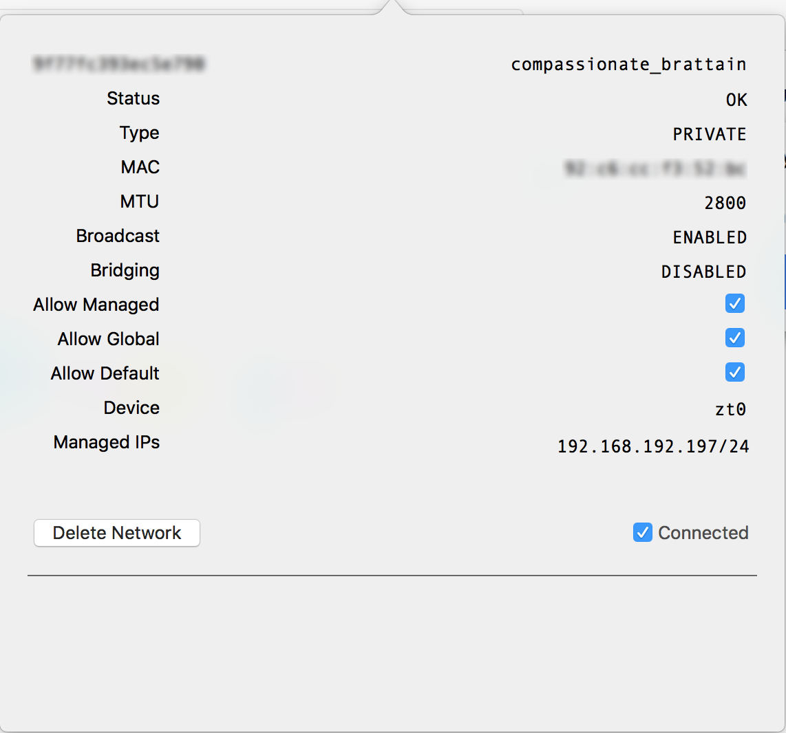

# 启用 ZeroTier 的 VPN 功能，通过 VPN 转发客户端流量

著名的 VPS 服务商 DigitalOcean 发布一篇非常详细使用的 ZeroTier 教程，作者是 Sam Cater [Twitter: @samcater](https://twitter.com/samcater)

[Getting Started with Software-Defined Networking and Creating a VPN with ZeroTier One](https://www.digitalocean.com/community/tutorials/getting-started-software-defined-networking-creating-vpn-zerotier-one?utm_medium=social&utm_source=twitter&utm_campaign=zerotier_tut&utm_content=no_image)

***以下内容参考 Sam Cater 教程中 [VPN 部分](https://www.digitalocean.com/community/tutorials/getting-started-software-defined-networking-creating-vpn-zerotier-one?utm_medium=social&utm_source=twitter&utm_campaign=zerotier_tut&utm_content=no_image#step-5-%E2%80%94-enabling-zerotier's-vpn-capability)进行了设置，证实可行，将过程记录如下：***

### 服务器环境

服务器系统为 Ubuntu 18.04，已安装 ZeroTierOne-1.2.10，并加入 ZeroTier PLANET 网络。

### 服务器设置

启用服务器 Linux 内核数据转发，查看当前配置，运行以下命令：

```
sudo sysctl net.ipv4.ip_forward
```

输出 ```net.ipv4.ip_forward = 0``` 为未启用，输出 ```net.ipv4.ip_forward = 1``` 为已启用。

假如未启用，需要设置为启用，运行以下命令：

```
sudo vi /etc/sysctl.conf
```

在 ```/etc/sysctl.conf``` 文件底部添加一行

```
net.ipv4.ip_forward = 1
```

```:wq!``` 保存并退出编辑状态

用 ```sysctl -p``` 命令触发新的内核配置，使其生效。

```
sudo sysctl -p
```

再次查看当前配置，运行以下命令：

```
sudo sysctl net.ipv4.ip_forward
```

输出显示已经启用数据转发：

```
net.ipv4.ip_forward = 1
```

用 ```ip link show``` 或 ```ip addr``` 显示网络接口的名称，输入如下（这是教程作者 Sam Cater 的输出内容，照搬过来）

```
1: lo: <LOOPBACK,UP,LOWER_UP> mtu 65536 qdisc noqueue state UNKNOWN mode DEFAULT group default qlen 1
    link/loopback 00:00:00:00:00:00 brd 00:00:00:00:00:00
2: eth0: <BROADCAST,MULTICAST,UP,LOWER_UP> mtu 1500 qdisc pfifo_fast state UP mode DEFAULT group default qlen 1000
    link/ether 72:2d:7e:6f:5e:08 brd ff:ff:ff:ff:ff:ff
3: zt0: <BROADCAST,MULTICAST,UP,LOWER_UP> mtu 2800 qdisc pfifo_fast state UNKNOWN mode DEFAULT group default qlen 1000
    link/ether be:82:8f:f3:b4:cd brd ff:ff:ff:ff:ff:ff
``` 

添加 ```iptables``` 规则

```
sudo iptables -t nat -A POSTROUTING -o eth0 -j MASQUERADE
sudo iptables -A FORWARD -m conntrack --ctstate RELATED,ESTABLISHED -j ACCEPT
```

允许 VPS 的网卡 eth0 转发所有 ZeroTier 虚拟网卡 zt0 的流量 

```
sudo iptables -A FORWARD -i zt0 -o eth0 -j ACCEPT
```

因为 iptables 规则会在 VPS 重启后丢失，安装 ```iptables-persistent``` 保存添加的规则

```
sudo apt install iptables-persistent
```
```
sudo netfilter-persistent save
```

运行后 ```sudo netfilter-persistent save``` 会有提示，分别保存 IPv4 和 IPv6 的规则，如果仅有 IPv4 yes，IPv6 no

查看已保存的规则：

```
sudo iptables-save
```

输出的规则内容如下：

```
# Generated by iptables-save v1.6.1 on Thu May 24 08:39:37 2018
*nat
:PREROUTING ACCEPT [256:29654]
:INPUT ACCEPT [230:28276]
:OUTPUT ACCEPT [2812:383290]
:POSTROUTING ACCEPT [2220:333986]
-A POSTROUTING -o eth0 -j MASQUERADE
-A POSTROUTING -o eth0 -j MASQUERADE
COMMIT
# Completed on Thu May 24 08:39:37 2018
# Generated by iptables-save v1.6.1 on Thu May 24 08:39:37 2018
*filter
:INPUT ACCEPT [39673:10536131]
:FORWARD ACCEPT [0:0]
:OUTPUT ACCEPT [41822:10787996]
:sshguard - [0:0]
-A INPUT -j sshguard
-A FORWARD -m conntrack --ctstate RELATED,ESTABLISHED -j ACCEPT
-A FORWARD -i zt0 -o eth0 -j ACCEPT
COMMIT
# Completed on Thu May 24 08:39:37 2018
```

显示已保存了转发规则，可以转发来自客户端的流量。

### 通过 https://my.zerotier.com/ 管理自己的网络

登录 https://my.zerotier.com/，建立自己的 ```Network ID```，这一部分参照教程作者 Sam Cater 的图文内容，很方便。

### 客户端设置

#### Linux 客户端

如果客户端是 Raspberry Pi 或其他 Linux 系统，编辑 ```/etc/sysctl.conf``` 文件：

```
sudo vi /etc/sysctl.conf
```

在 ```/etc/sysctl.conf``` 文件底部添加一行

```
net.ipv4.conf.all.rp_filter=2
```

```:wq!``` 保存并退出编辑状态

用 ```sysctl -p``` 命令触发新的内核配置，使其生效。

```
sudo sysctl -p
```
查看输出内容，显示内核配置已更新：

```
net.ipv4.conf.all.rp_filter = 2
```

在客户端用 ```zerotier-cli``` 命令设置转发流量，下面的 ```NetworkID``` 指 https://my.zerotier.com/ 分配到的 16 位长度的 ```Network ID```，如 ```8uhgr5689uyt532s```

```
sudo zerotier-cli set 8uhgr5689uyt532s allowDefault=1
```

```allowDefault=1``` 表示启用 ZeroTier 转发全部流量，```allowDefault=1``` 表示禁用 ZeroTier 转发全部流量。

执行上面的命令后，会输出以下设置参数：

```
{
 "allowDefault": true,
 "allowGlobal": false,
 "allowManaged": true,
 "assignedAddresses": [
  "192.168.192.100/24"
 ],
 "bridge": false,
 "broadcastEnabled": true,
 "dhcp": false,
 "id": "8uhgr5689uyt532s",
 "mac": "00:00:00:00:00:00",
 "mtu": 2800,
 "name": "compassionate_brattain",
 "netconfRevision": 3,
 "nwid": "8uhgr5689uyt532s",
 "portDeviceName": "zt0",
 "portError": 0,
 "routes": [
  {
   "flags": 0,
   "metric": 0,
   "target": "192.168.192.0/24",
   "via": null
  },
  {
   "flags": 0,
   "metric": 0,
   "target": "0.0.0.0/0",
   "via": "192.168.192.1"
  }
 ],
 "status": "OK",
 "type": "PRIVATE"
```

查看和 VPS 端建立的 ZeroTier VPN状态：

```
ping 192.168.192.1
```

看 ping 的数据包是否正常，或

```
curl ifconfig.me
```

输出的 IP 地址如果是 VPS 的公网 IP，说明 VPN 隧道建立成功，如果没有输出结果或 IP 为本地 ISP 分配的，说明 VPN 隧道不成功。

linux 桌面系统没有 GUI，通过 ```zerotier-cli``` 设置，方法和上面一样，可以通过浏览器访问 https://www.google.com 来验证是否成功建立 VPN 隧道。

#### macOS 系统

macOS 系统可以从官方下载编译好的安装包，有 GUI 管理界面，很方便设置。

ZeroTier One.pkg 下载地址：https://download.zerotier.com/RELEASES/1.2.10/dist/

安装完成后在屏幕顶部菜单栏有 ZeroTier One 图标，点击 ```Join Network``` 菜单，输入 https://my.zerotier.com/ 分配到的 16 位长度的 ```Network ID```，如 ```8uhgr5689uyt532s```，在 https://my.zerotier.com/ 勾选新加入的 macOS 客户端。

打开 ZeroTier One 的 ```Network Details``` 菜单，会显示 ZeroTier 网络详情，如下图：



上图中有三个勾选项都要勾选，```Allow Managed``` ```Allow Global``` ```Allow Default``` 

用 ping 命令查看和 VPS 端建立的 ZeroTier VPN状态：

```
ping 192.168.192.1
```

看 ping 的数据包是否正常，或通过浏览器访问 https://www.google.com 来验证是否成功建立 VPN 隧道。
