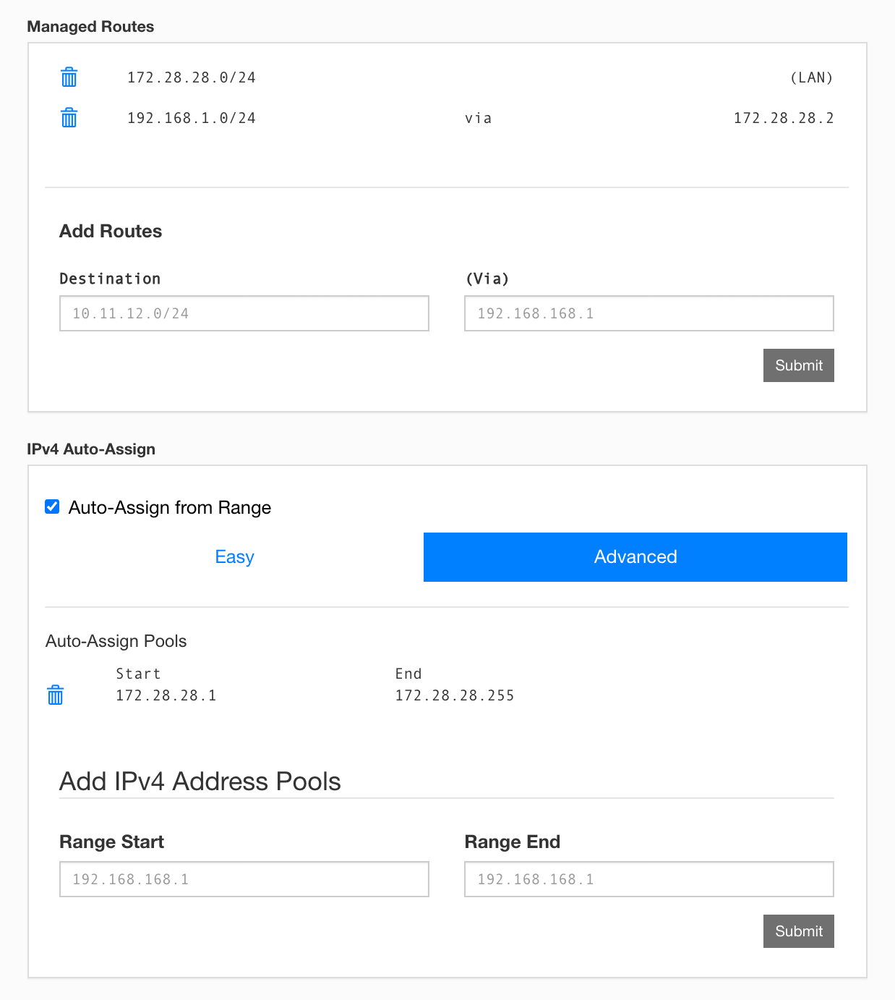

# 在 OpenWrt 安装设置 ZeroTier 并实现内网访问

重新用 ZeroTier 组网有些生疏，记录一下桌面系统 VirtualBox 虚拟机环境中 OpenWrt 安装设置 ZeroTier，实现访问内网设备。以下内容非完整记录，只有大致步骤和重要内容，网上现在有很多关于 ZeroTier 组网的图文教程，可以 Google 搜索。

VirtualBox 版本为 6.1.4，运行在本地桌面系统 macOS/Manjaro

OpenWrt 版本为 19.07.2 (x86_64)，运行在 VirtualBox 环境中

ZeroTier 版本为 1.4.6 ([ZeroTier-OpenWrt](https://github.com/mwarning/zerotier-openwrt))

VPS 系统为 Ubuntu 19.10

### 在 VirtualBox 虚拟机中安装 OpenWrt

安装 OpenWrt 建议参考官方文档 [OpenWrt on VirtualBox HowTo](https://openwrt.org/docs/guide-user/virtualization/virtualbox-vm)，为了安装方便简洁，VirtualBox 网络设置可以选择桥接模式，而不是 NAT 模式。

### 在 OpenWrt 中安装 ZeroTier

ZeroTier 版本为 1.4.6 ([ZeroTier-OpenWrt](https://github.com/mwarning/zerotier-openwrt))，可以使用 LuCI 安装，在 ```System``` -> ```Software```，先更新包列表 ```Update lists```，然后在筛选搜索中 zerotier，列出 zerotier 包，执行安装，同时会安装 ZeroTier 依赖包。

也可以使用命令行安装，顺带更新 OpenWrt 的其他包。

```
opkg update
opkg list-upgradable
opkg list-upgradable | sed -e "s/\s.*//" | while read PKG_NAME; do opkg upgrade "${PKG_NAME}"; done
opkg install zerotier
```

### 注册 ZeroTier 网络服务，创建自己的 ZeroTier 网络

在 ZeroTier 提供的公共服务平台 [my.zerotier.com](https://my.zerotier.com) 建立自己的 ZeroTier 免费网络。

先申请自己的 ZeroTier 网络 ID，```Network ID:``` 申请后会得到 16 位字符长度的网络 ID，并进行简单的内网网段和路由设置，

[ZeroTier-OpenWrt WiKi](https://github.com/mwarning/zerotier-openwrt/wiki)，摘一部分列在下面：

```
ZeroTier Controller
-------------------
Network ID: 8ad5123ed69d6f69
 IPv4 Auto-Assign (advanced)
  [x] Auto-Assign from Range: 172.28.28.1-172.28.28.255
 Managed Routes:
  172.28.28.0/24   (LAN)
  192.168.1.0/24   (172.28.28.1)
 IPv6 Auto-Assign
  [ ] ZeroTier RFC4193 (/128 for each device)
  [ ] ZeroTier 6PLANE (/80 routable for each device)
  [ ] Auto-Assign from Range
```

上面 ```Network ID: 8ad5123ed69d6f69``` 具有唯一性，每位 ZeroTier 用户都有唯一的 ID，一个用户可以申请多个 ID。

```[x] Auto-Assign from Range: 172.28.28.1-172.28.28.255``` 为 ZeroTier 管理的内网网段，路由 ```72.28.28.0/24```，``` IPv6 Auto-Assign``` 未选，所以只设置 IPv4。

这一部分可以参考官方手册：[Getting Started with ZeroTier
](https://zerotier.atlassian.net/wiki/spaces/SD/pages/8454145/Getting+Started+with+ZeroTier)，也可以 Google 搜索 ```“zerotier 教程 OR 内网”```，有很多非常实用的图文教程。

### 在 OpenWrt 上配置 ZeroTier (1/3)

这一部分内容可以参考 [ZeroTier-OpenWrt WiKi](https://github.com/mwarning/zerotier-openwrt/wiki)，摘一部分列在下面：

ZeroTier 安装后会生成默认的配置文件 ```/etc/config/zerotier```

```
root@OpenWrt:~# cat /etc/config/zerotier 

config zerotier sample_config
	option enabled 0

	# persistent configuration folder (for ZT controller mode)
	#option config_path '/etc/zerotier'

	#option port '9993'

	# Generate secret on first start
	option secret ''

	# Join a public network called Earth
	list join '8056c2e21c000001'
	#list join '<other_network>'
```
默认的配置文件不用修改，直接添加自己的 ZeroTier ID: ```8ad5123ed69d6f69```

```
root@OpenWrt:~# uci set zerotier.openwrt_network=zerotier
root@OpenWrt:~# uci add_list zerotier.openwrt_network.join='8ad5123ed69d6f69'
root@OpenWrt:~# uci set zerotier.openwrt_network.enabled='1'
root@OpenWrt:~# uci commit zerotier
```

上面四行命令挨个操作，其中 ```zerotier.openwrt_network.join='8ad5123ed69d6f69'``` 的 ID 要改成自己的，输出配置文件检查一下。

```
root@openwrt:~# cat /etc/config/zerotier

config zerotier 'sample_config'
	option enabled '0'
	list join '8056c2e21c000001'

config zerotier 'openwrt_network'
	list join '8ad5123ed69d6f69'
	option enabled '1'
  option secret '41c7017c10:0:**************************'

root@openwrt:~# reboot
```

上面显示已添加 ID ```'8ad5123ed69d6f69'```，重启 OpenWrt...

重启后查看客户端状态

```
root@openwrt:~# zerotier-cli info
200 info 41c7017c10 offline 1.4.6
```

```41c7017c10``` 为客户端 ID，前去 my.zerotier.com 认证并同意 ```41c7017c10``` 加入自己的网络，再回到 OpenWrt 查看网络状态

```
root@OpenWrt:~# zerotier-cli info
200 info 41c7017c10 1.4.6 ONLINE
```

### 在 VPS 建立 Moon（非必须，可以忽略）

VPS 系统为 Ubuntu 19.10（其他主流 Linux 发行版都可以），用 ZeroTier 官方的跨平台安装脚本```ZeroTier install script```

```
zerotier@ubuntu:~# curl -s https://install.zerotier.com/ | sudo bash
```

安装完成后加入自己的 ZeroTier 网络

```
zerotier@ubuntu:~# sudo zerotier-cli join 8ad5123ed69d6f69
zerotier@ubuntu:~# sudo zerotier-cli info
  200 info 4c6c00c9a0 1.4.6 ONLINE
```

```4c6c00c9a0``` 为 VPS 的客户端 ID，前去 my.zerotier.com 认证并同意 ```4c6c00c9a0``` 加入自己的网络

在 VPS 创建 moon 模版

```
zerotier@ubuntu:~# sudo -i
root@ubuntu:~# cd /var/lib/zerotier-one
root@ubuntu:/var/lib/zerotier-one# zerotier-idtool initmoon identity.public >> moon.json
root@ubuntu:/var/lib/zerotier-one# vi moon.json

{
 "id": "4c6c00c9a0",
 "objtype": "world",
 "roots": [
  {
   "identity": "4c6c00c9a0:0:**************************",
   "stableEndpoints": ["VPS public IP/9993"]
  }
 ],
 "signingKey": "**************************",
 "signingKey_SECRET": "**************************",
 "updatesMustBeSignedBy": "**************************",
 "worldType": "moon"
}
```

上面就是 VPS 中 moon 的模版内容，其中

```"id": "4c6c00c9a0",``` 是客户端 ID

```"stableEndpoints": ["VPS public IP/9993"]``` 这一行需要修改，将双引号中的内容 ```VPS public IP/9993``` 修改为 VPS 的公网 IP，改完后一般是这样 ```11.22.33.44/9993```，端口号 ```/9993``` 保留。这个端口可以自定义，非 9993 也可以，无论哪个端口都要在防火墙放行。

```"**************************"``` 全部为生成的身份和认证信息，不可以修改。

生成 moon 配置文件

```
root@ubuntu:/var/lib/zerotier-one# zerotier-idtool genmoon moon.json
root@ubuntu:/var/lib/zerotier-one# mkdir moons.d
root@ubuntu:/var/lib/zerotier-one# mv 0000004c6c00c9a0.moon moons.d/
root@ubuntu:/var/lib/zerotier-one# systemctl restart zerotier-one
root@ubuntu:/var/lib/zerotier-one# zerotier-cli listmoons

[
 {
  "id": "0000004c6c00c9a0",
  "roots": [
   {
    "identity": "4c6c00c9a0:0:**************************",
    "stableEndpoints": [
     "11.22.33.44/9993"
    ]
   }
  ],
  "signature": "**************************",
  "timestamp": **************************,
  "updatesMustBeSignedBy": "**************************",
  "waiting": false
 }
]
```

```0000004c6c00c9a0.moon``` 是生成的 Moon 配置文件，不用修改，移至新建的 moons.d 目录中，并重启 ```zerotier-one``` 服务

### 在 OpenWrt 上配置 ZeroTier (2/3)

将 OpenWrt 加入自己的 ZeroTier Moons 网络，命令为 ```zerotier-cli orbit```，Moon ID 要输两遍，有多个 Moons 可以都依次添加进来。

```
root@OpenWrt:~# zerotier-cli orbit 4c6c00c9a0 4c6c00c9a0
root@OpenWrt:~# zerotier-cli listpeers

  200 listpeers <ztaddr> <path> <latency> <version> <role>
  200 listpeers 4c6c00c9a0 11.22.33.44/9993;6379;6379 56 1.4.6 LEAF
  200 listpeers 8841408a2e 99.88.77.66/9993;6426;6259 168 - PLANET
  200 listpeers 9d219039f3 88.77.66.55/9993;6426;6172 255 - PLANET
  200 listpeers 092fcf15b7 77.66.55.44/9993;6427;6201 229 - PLANET
```

```zerotier-cli listpeers``` 命令可以列出 OpenWrt 加入的 ZeroTier 网络节点状态，ztaddr 地址 ```4c6c00c9a0``` 就是自己的 Moon 服务器角色为 LEAF（老版本会显示为 MOON，），其他三个角色为 PLANET 地址为 ZeroTier 官方的行星服务器。

### 在 ZeroTier 控制台 [my.zerotier.com](https://my.zerotier.com) 设置 OpenWrt 的路由

设置非常简单，看下面截图内容



至此，ZeroTier 网络环境益基本搭建完毕，共有三部分，ZeroTier 网络控制台、VPS 上的 Moon 服务器、本地的 OpenWrt。通过 ZeroTier 建立的 Moon 服务器和 OpenWrt 的虚拟网段已都分配到了各自的 IP 地址：

OpenWrt：```172.28.28.2``` (ZT IP)，LAN 的物理 IP 为 ```192.168.1.2```

VPS 上的 Moon 服务器：```172.28.28.10``` (ZT IP)，公网 IP 为 ```11.22.33.44```

我们的目的很简单，在 VPS 上能访问 ```192.168.1.2``` 这个 IP 地址以及 ```192.168.1.0/24``` 的设备就可以。

### 在 OpenWrt 上配置 ZeroTier (3/3)

这一部分还是参考 [ZeroTier-OpenWrt WiKi](https://github.com/mwarning/zerotier-openwrt/wiki)，摘一部分列在下面：

```
root@OpenWrt:~# uci add firewall rule
root@OpenWrt:~# uci set firewall.@rule[-1].name='Allow-ZeroTier-Inbound'
root@OpenWrt:~# uci set firewall.@rule[-1].src='*'
root@OpenWrt:~# uci set firewall.@rule[-1].target='ACCEPT'
root@OpenWrt:~# uci set firewall.@rule[-1].proto='udp'
root@OpenWrt:~# uci set firewall.@rule[-1].dest_port='9993'
root@OpenWrt:~# uci commit firewall
root@OpenWrt:~# /etc/init.d/firewall restart
```

```/etc/config/firewall```输出 OpenWrt 的防火墙配置核对一下添加的防火墙规则： 

```
root@OpenWrt:~# cat /etc/config/firewall

config rule
  ... ...
  option name 'Allow-ZeroTier-Inbound'
	option src '*'
	option target 'ACCEPT'
	option proto 'udp'
	option dest_port '9993'
```

在本地访问 ```http://192.168.1.2```，进入 ```Network``` -> ```Firewall``` -> ```Custom Rules```，添加一行自定义防火墙规则

```
iptables -t nat -A POSTROUTING -j MASQUERADE
```

因为以上操作的目的就是访问局域网的内网设备，所以以最简单的方法实现就好。自定义防火墙规则可以 Google 搜索 ```zerotier "iptables -t nat -A POSTROUTING -j MASQUERADE"```

以上都完成后，可以 Nmap 扫描一下 ```192.168.1.0/24``` 内网的网段，应该会列出内网的物理设备，列出的设备按开放的端口和提供的服务就可以访问了。
